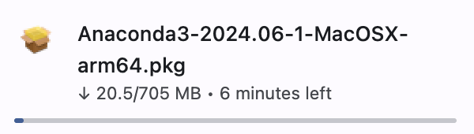

<a href="https://chat.vercel.ai/">
  
  <h1 align="center">The Cat Cafe</h1>
</a>

  A Cat Cafe intelligent chatbot by [Your Name] backed by an LLM.

  <a href="#python-installation"><strong>Python Installation</strong></a> ·
  <a href="#features"><strong>Features</strong></a> ·

 

## Python Installation

We'll follow roughly the same installation procedures depending on whether you're using Mac or Windows. A video is linked in each which breaks down the process step by step.

### Mac Python Installation

Visit the [Anaconda download page](https://www.anaconda.com/download/success)

Click the button to download for Mac.

[Mac download button](./media/mac-download-button.png)

Then choose your CPU version.

[Choose between Intel and Apple Silicon](./media/intel-vs-applesilicon.png)

If you're not sure which version you are, check out this [how-to](https://support.apple.com/en-us/116943) from Apple Support.

Give this a bit of time, depending on your internet speed.

Follow the installation instructions to get it installed.

Now open your terminal and run the following commands:

    conda create --name makethejump python=3.11

    conda activate makethejump

#### Any issues?

Reach out to me personally at sam@samschneider.me with any issues you experience. I'll make sure we get you on track.

### Windows Python Installation

Visit the [Anaconda download page](https://www.anaconda.com/download/success)
